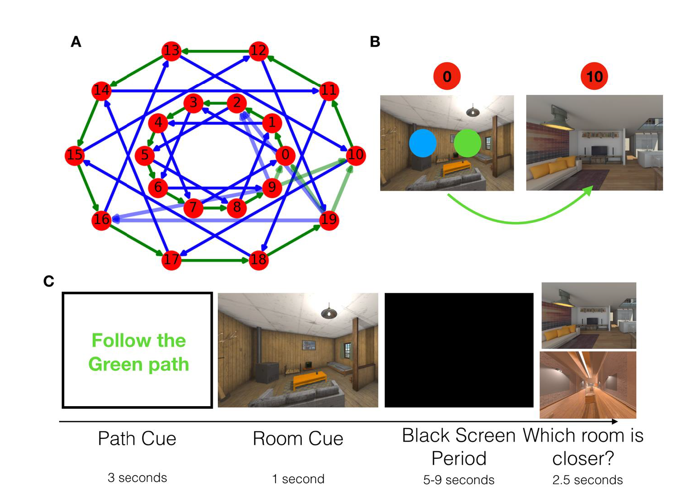

```{r setup, include=FALSE}
knitr::opts_chunk$set(echo = TRUE)

baseDir<-getwd()

source("pred_nav_analysis.R")

#load packages
library(ggplot2)
library(tidyverse)
library(gridExtra)

#setwd back to the main directory
setwd(baseDir)
```

Memory for previous experiences does not merely allow us to reflect on our past, but enables preparation for the future. One way in which this is accomplished is through prediction: knowledge of sequential structure in our environment enables anticipation of upcoming events. For example, when we are navigating from our house to the grocery store, we can predict upcoming locations on our route. Evidence for prediction of upcoming events has been shown across multiple brain regions such as the hippocampus, mPFC, and visual cortex (Johnson & Redish, 2007; Brown et al., 2016; Long, Lee & Kuhl, 2016; Hindy, Ng & Turk-Browne, 2016). 

For efficient planning, however, we should predict multiple steps into the future simultaneously. For example, when navigating from our house to the grocery store, we may predict which event is occurring next, such as an upcoming intersection, and which events are occurring farther in the future, such as arriving at the grocery store. What are the neural underpinnings of multi-step prediction? It is postulated that the brain represents retrospective information on a hierarchy, with shorter timescale information represented in posterior regions and longer timescale information in anterior regions (Hasson, Chen & Honey, 2015). An intriguing but unresolved question is whether the neural underpinnings of multi-step prediction rely on this cortical hierarchy as well. Further, an important but unresolved question is how predictions are updated when we encounter new information about our environments. Memory integration, the process by which separate but related experiences become linked in the brain (Schlichting & Preston, 2015), is proposed to be enhanced by the strength of predictions (Schlichting, Mumford, & Preston, 2015; Long et al., 2016). Changes to pre-existing predictive representations after integration, however, have yet to be explored. The current study uses a novel paradigm to investigate the neural mechanisms of multi-step prediction, and how multi-step predictions are updated after memory integration. 

Evidence for forward prediction in the brain was first shown in rodent work investigating place cell firing. As rodents navigated a maze, place cells for upcoming locations, as opposed to place cells which reflect the rodent’s current location, fired in the hippocampus at a decision point (Johnson & Redish, 2007). This is thought to reflect prediction of upcoming events. Indeed, evidence for prediction in the hippocampus has been shown across many studies in both humans and non-human animals (Schapiro, Kustner & Turk-Browne, 2012; Pfeiffer & Foster, 2013; Brown et al., 2016; Kok & Turk-Browne, 2016;). Prediction has also been shown to occur across multiple other brain regions. For example, one study found evidence for strong neural predictions in the mPFC and PPC (Long et al., 2016). Other studies have shown that prediction can happen in lower order regions such as the visual cortex (Hindy et al., 2016; Kok, Jehee & de Lange, 2012). 

In a seminal paper on forward prediction, participants navigated a well learned environment to reach navigational goals. At the start of navigation, participants were first asked to plan their route. During the planning period, it was found that the hippocampus and OFC represented the upcoming goal location, reflecting prospection. Importantly, this was not only found for the goal location, but for other locations that participants would traverse on that route, known as sub-goals (Brown et al., 2016). This provides preliminary evidence for the neural representation of multi-step prediction, but Brown et al. (2016) only showed prediction two steps into the future—the goal and the sub-goal. Further, they did not study the timescale of these two-step predictions across brain regions (Brown et al., 2016).
 
A separate body of work on information representation may provide a window into understanding the timescale of multi-step prediction. Recently, theories on information processing in the brain have been gaining traction. These theories postulate that we acquire information from our environment at multiple timescales, and different brain regions process this information within distinct temporal receptive windows. Lower order regions such as early sensory areas process information on short timescales, while higher order regions process information on long timescales (Hasson et al., 2015). This cortical hierarchy of information processing has been shown for narrative processing (Chen et al., 2016), as well as the granularity at which we segment events (Baldassano et al., 2017). A similar hierarchy has been proposed within the hippocampal long axis: fine grained information may be represented in the posterior hippocampus while coarse grained information is represented in the anterior hippocampus (Poppenk et al., 2013; Strange et al., 2014). Indeed, a recent study investigated hippocampal activity as participants navigated familiar routes. Consistent with a processing hierarchy in the hippocampal long axis, they found evidence for short timescale information in posterior hippocampus and long timescale information in anterior hippocampus (Brunec et al., 2018). This cortical hierarchy, however, has only been investigated for the accumulation of retrospective information. Bridging work on prediction and information processing, this study aims to extend evidence for a representational hierarchy to prospective information. We propose that multi-step prediction may be represented across this cortical hierarchy, with lower order regions and posterior hippocampus representing prediction fewer steps into the future than higher order regions and anterior hippocampus. 

The second question this study seeks to address is how neural predictions are updated when our environments are updated with new information. One way in which this can occur is the process of memory integration, whereby two separate but related experiences can become linked in the brain (Schlichting & Preston, 2015). Memory integration has been shown to involve, among other regions, the hippocampus and mPFC (Zeithamova, Dominick & Preston, 2012), two regions which are also implicated in prediction (Long et al., 2016). Indeed, previous work has strongly suggested that prediction plays an important role in memory integration (Schlichting et al., 2015), and it has been shown that the strength of neural predictions is positively correlated with successful memory integration (Long et al., 2016). However, it has yet to be shown whether integration influences prediction. Can integration update our predictions, and if so, how rapidly? 

If predictions are updated after integration, a critical question is how this is achieved. On one hand, theories of sequence learning propose that predictions are built up slowly, after multiple, repeated experiences (Davachi & Dubrow, 2015). This is consistent with findings from statistical learning tasks. For example, there is evidence of forward prediction for items in a structured sequence after multiple exposures to that sequence (Schapiro et al., 2012). This perspective suggests that predictions are built up slowly over time and multiple learning experiences. On the other hand, episodic memory integration provides evidence for mnemonic updating after a single shot learning experience, such as in the associative inference paradigm. In this paradigm, participants learn that A and B go together. They then learn that A and C also go together, providing an indirect link between B and C (Schlichting & Preston, 2015; Duncan & Schlichting, 2018). Indeed, it has been shown that hippocampal-mPFC representations are altered after new information is integrated into existing memories (Milivojevic, Vicente-Grabovetsky & Doeller, 2015). Following this logic, predictions about upcoming events may be updated rapidly upon encountering new information. Although memory integration has been well studied, the lasting effects of integration on mnemonic predictions have yet to be investigated. 

In the current study, we leverage neural evidence of processing hierarchies, prediction, and memory integration to make predictions about the representation of multi-step predictions behaviourally and in the brain and how they are updated to reflect new information using a novel, naturalistic paradigm. On day one, participants learn to navigate through a series of rooms in virtual reality in two maps. Critically, these rooms have a constant order, allowing participants to predict upcoming rooms on their route. On day 2, participants predict rooms in the sequence in a behavioural task. We then give them linking information to integrate the two maps into a cohesive whole, and have them predict using the integrated map. We hypothesize that multi-step predictions will be represented on a cortical hierarchy, with lower order regions predicting fewer steps into the future than higher order regions. We further predict that integration will update predictions. However, this updating could happen slowly, requiring time and experience, or quickly, as a result of single shot learning.
  
## Method

### Participants

Participants included seven young adults (M age = XX, XX female) recruited from the Columbia University area and were compensated \$15/hour for their participation in the study. All participants gave consent in accordance with the Columbia University Institutional Review Board. 

### Procedure 

To investigate the multi-step prediction, participants will completed three behavioral tasks over two days: an encoding phase, a prediction phase, and an integration phase (Figure 1). The encoding phase took place on day ne and employed the of immersive virtual reality and the prediction phase and integration phase took place on day two. 

On day one, participants encoded the order of rooms in virtual reality using an Oculus rift. They learned two maps, Map A and Map B, which each contained 8 distinct rooms (Figure 1a). Critically, the order of rooms in each map remained constant order throughout the experiment, allowing participants to predict upcoming rooms in the sequence. The identity and order of rooms in Map A and B were randomized across participants. Participants were told that their goal was to learn and memorize the order of the rooms. Within each map (A and B), participants learned two trajectories: the Green Path and the Blue Path (Figure 1a). Critically, the Green and Blue paths contained the exact same rooms but in a different order. BORROW WORDING FROM  PROJECT PROPOSAL. This will allow us to disentangle the specific timescale of multistep prediction from a more general similarity signal. Therefore, each participant learned a total of four sequences (Map A Green, Map A Blue, Map B Green, Map B Blue). To help participants encode all the sequences, participants were instructed to generate distinct stories to link the rooms in order in each sequence. 

Participants first generated a story for Map A Green and then experienced the order in immersive virtual reality six times. They then repeated this procedure for Map A Blue. Participants were then taken out of VR and asked to recall the order of the Map A sequences. Participants then completed the same procedure for Map B Green and Map B Blue. 

During learning in virtual reality, participants were placed in the starting room for the given sequence. After five seconds, one green sphere and one blue sphere appeared. Participants were instructed to reach out with their virtual hands and touch either the green or blue sphere, depending on which path they were learning in the trial. This teleported them to the next room in the order Figure 1b). After 20% of VR trials, participants were shown pictures of two upcoming rooms and are asked to indicate which room is coming up sooner in the order to ensure they were learning the sequence. The encoding phase took approximately 1.5 hours to complete. 

Participants then returned 24 hours later for the prediction and integration phases. Participants first recalled the order of all four sequences, and the stories that linked them in order. In the prediction phase, participants were shown a room from either Map A or Map B with a path cue (Green or Blue) for 3 seconds. This was followed by a completely black screen for a variable duration of 5 to 9 seconds. They then saw two pictures of upcoming rooms from 1 to 5 rooms in the future and were instructed to respond which room was coming up sooner in the order. Critically, participants only had 3 seconds to respond. However, participants were told they could use the black screen period to “prepare their response”, giving participants time to anticipate upcoming rooms in the order. Participants completed 2 blocks of the prediction phase, and they are tested on each room from Map A and B on the blue and green route in each block, trials lasting approximately 21 minutes. 

In the integration phase, participants were taught that some of the old connections between rooms have been broken, and new connections are formed between Map A and Map B on both the blue and the green routes, forcing them to integrate the two maps into a coherent whole (Figure 2a and b). Participants watch four separate videos. Each video starts with a green route or blue route cue, and then a 360 degree pan of one of the rooms. The video then transitions to the next room in the order but, critically, if the first room in the video is Map A then the second will be in Map B and vice versa. This means that, from this single shot learning experience, participants can now predict multiple steps into Map B from Map A and into Map A from Map B. The integration rooms which link Map A and B will be predetermined and chosen randomly for each participant. Finally, participants then complete two additional runs of the prediction phase, but this time approximately 50% of the answers require participants to predict into the integrated map (i.e. predict into Map B from Map A) to get the correct response (Figure 2c). Everything else about the prediction phase will remain the same. We will then analyze the black screen period as a measure of prediction updating on critical trials where participants must predict into the integrated map. 

```{r, echo=FALSE}

```

## Results

To determine whether participants generate and use predictions at multiple timescales, we first analyzed behaviour from the Prediction Phase. As this dataset only contained seven participants, here we present only descriptive statistics along with visualizations as our power is too low to run inferential statistics. 

Firstly, to determine whether participants generated predictions, we calculated overall accuraccy for the prediction phase. All participants were able to learn the sequence, and successfully generated predictions about upcoming rooms in the sequence at a range of timescales(M = `r round(mean(acc$mean_acc), digits =2)`, SD = `r round(sd(acc$mean_acc), digits =2)`). Next,as participants learned two maps (Map A and Map B), we calculated prediction phase accuracy for Map A and Map B, respectively. We found that, numerically, there was no difference in performance for Map A blocks (M = `r round(mean(acc_map$A), digits =2)`, SD = `r round(sd(acc_map$A), digits =2)`)  vs. Map B blocks (M = `r round(mean(acc_map$B), digits =2)`, SD = `r round(sd(acc_map$B), digits =2)`) in the prediction test, indicating participants learned the sequences in both maps. Participants also learned two paths within a map (Green Path and Blue Path). We found that, numerically, performance was similar for Green Path blocks (M = `r round(mean(acc_path$green), digits =2)`, SD = `r round(sd(acc_path$green), digits =2)`) vs. Blue Path blocks (M = `r round(mean(acc_path$blue), digits =2)`, SD = `r round(sd(acc_path$blue), digits =2)`) in the prediction test across participants (Figure 2). This indicates that (1) there was no retroactive or proactive interference due to the order in which the paths were learned and, critically, (2) participants used context to successfully guide which predictions were used when multiple predictions were available. 

```{r, out.width = "800px", echo=FALSE}
plot_path #accuracy for green/blue paths
```

*Figure 2* Accuracy for Green and Blue Paths. Participants' performance was equivalent for the Green and Blue paths. This inidcates that, as expected, participants can use context (green context or blue context) to flexibly guide which predictions to use.


We were next able to test whether the amount of prediction time, the distance into the future of the correct answer, and the interaction of the two influenced performance on the prediction test. We found that the prediction time (5, 6, 7, or 8 seconds) did not appear to numerically influence accuracy on the prediction test (5: M = `r round(mean(acc_pred_time$five), digits=2)`, SD = `r round(sd(acc_pred_time$five), digits=2)`; 6: M = `r round(mean(acc_pred_time$six), digits=2)`, SD = `r round(sd(acc_pred_time$six), digits=2)`; 7: M = `r round(mean(acc_pred_time$seven), digits=2)`, SD = `r round(sd(acc_pred_time$seven), digits=2)`; 8: M = `r round(mean(acc_pred_time$eight), digits=2)`,  SD = `r round(sd(acc_pred_time$eight), digits=2)`). However, the distance into the future of the correct answer (1, 2, 3, or 4 rooms ahead in the sequence) did numerically influence accuracy. Performance was mostly equivalent for 1 (M = `r round(mean(acc_future$one), digits=2)`, SD = `r round(sd(acc_future$one), digits=2)`), 2 (M = `r round(mean(acc_future$two), digits=2)`, SD = `r round(sd(acc_future$two), digits=2)`), and 3 (M = `r round(mean(acc_future$three), digits=2)`, SD = `r round(sd(acc_future$three), digits=2)`) rooms into the future. However, performance was numerically lower for 4 rooms into the future (M = `r round(mean(acc_future$four), digits=2)`, SD = `r round(sd(acc_future$four), digits=2)`; Figure 3). Interestingly, there was an interaction between prediction time and number of rooms ahead the correct answer was: accuracy for 4 rooms into the future lowest for the shortest prediction time (M = `r round(mean(acc_time_four$five, na.rm=T), digits=2)`, SD = `r round(sd(acc_time_four$five, na.rm=T), digits=2)`), and increased with the amount of prediction time (M = `r round(mean(acc_time_four$eight), digits=2)`, SD = .`r round(sd(acc_time_four$eight), digits=2)`; See Figure 4). 

```{r, out.width="800px", echo=FALSE}
plot_distance #accuracy for correct distance into future 
```

*Figure 3* Accuracy for Number of Steps into the Future. Participants' performance was similar on trials that required participants to predict one to three rooms ahead in the sequence, but were numerically worse on trials that required prediction four rooms ahead. 

```{r, out.width="800px", echo=FALSE}
plot_distance_time #accuracy for correct distance into future x pred time
```

*Figure 4* Accuracy for Prediction Time by Number of Steps into the Future. When participants are given less time to predict (e.g. 5 seconds), their performance is worse for trials where they have to predict farther into the future (e.g 4 rooms into the future). However, as prediction time increases, so does accuracy on these farther trials. Conversely, long prediction times do not decrease performance on trials where participants predict close rooms (i.e. 1 room into the future)


We next turned to our second question of interest: how are predictions updated after memory integration? To answer this question, we analyzed the behviaoural data from the integration portion of the experiment. Collapsing across both the integrated and non-integrated paths across participants, performance was much higher than chance (50%), but numerically lower than in the prediction task (M = `r round(mean(acc_int$mean_acc), digits=2)`, digits=2), SD = `r round(sd(acc_int$mean_acc), digits=2)`). Participants did numerically better on the non-integrated path (M = `r round(mean(acc_int_noint$No_Int), digits=2)`, SD = `r round(sd(acc_int_noint$No_Int), digits=2)`) than on the integrated path (M = `r round(mean(acc_int_noint$Int), digits=2)`, SD = `r round(sd(acc_int_noint$Int), digits=2)`; Figure 5), which is to be expected as the integration condition is more difficult and requires the flexible use of previously learned predicitons. 

```{r, out.width="800px", echo = FALSE}
plot_int_noInt #int vs no int cond
```

*Figure 5* Accuracy for Integration and No Integration Conditions. Participants performance was worse for the integration as compared to the no integration condition. However, given the difficulty of the integration condtion, the difference between the two conditions is not as large as would be expected. 

As a proxy for understanding the timescale on which predictions are updated after integration, we looked at accuracy across each run of the integration test. As can be seen in Figure 6, accuracy increased as run number increased for almost all of the participants (Run 1: `r round(mean(acc_run_int$one), digits=2)`, SD = `r round(sd(acc_run_int$one), digits=2)`; Run 4: `r round(mean(acc_run_int$four, na.rm=T), digits=2)`, SD = `r round(sd(acc_run_int$four, na.rm=T), digits=2)`). Further, accuracy was lower in the first two blocks for the integration (M = `r round(first_half_int, digits=2)`) as compared to the non-integration (M = `r round(first_half_noint, digits=2)`), but accuracy converged for both integration (M = `r round(second_half_int, digits=2)`) and non-integration (M = `r round(second_half_noint, digits=2)`) in the third and fourth blocks. This indicates that, over time, participants updated their predictions after integration. The selective increase in accuracy for the integration condition across runs can be seen in the interactive figure below (Figure 7).  
  

```{r, out.width = "800px", echo=FALSE}
#plots for the integration portion
plot_run_int #accuracy for runs (spag plot)
```

*Figure 6* Accuracy on the Integration Test Across Runs. Performance for nearly all participants improves as a function of run number on the integration test. Importantly, participants only learn the integrating links between maps A and B once. This indicates that, even after a single shot learning experience, predictions are updated over time to reflect updated strucutre in our environemnts. 

```{r, echo = FALSE}
#shiny plot to look at plots by run
#remake integration data to prepare for shiny

shiny_prep<-cast(int_data, participant + Int_All_Runs.thisN + cond~., mean, value = "acc", na.rm=T, subset = (cond != ""))
colnames(shiny_prep)[colnames(shiny_prep)=="(all)"] <- "mean_acc"
shiny_prep$Run_1<-ifelse(shiny_prep$Int_All_Runs.thisN == 0, TRUE, FALSE)
shiny_prep$Run_2<-ifelse(shiny_prep$Int_All_Runs.thisN == 1, TRUE, FALSE)
shiny_prep$Run_3<-ifelse(shiny_prep$Int_All_Runs.thisN == 2, TRUE, FALSE)
shiny_prep$Run_4<-ifelse(shiny_prep$Int_All_Runs.thisN == 3, TRUE, FALSE)

shiny_bar_prep<-cast(int_data, cond~., mean, value = "acc", na.rm=T, subset = (cond != ""))
colnames(shiny_bar_prep)[colnames(shiny_bar_prep)=="(all)"] <- "mean_acc"

inputPanel(
  selectInput("Run", label = "Integration Activity by Run:",
              choices = c("Run_1", "Run_2", "Run_3", "Run_4"),
              selected = "Run_1")
)

renderPlot({
  ggplot(data = shiny_prep, aes(cond, mean_acc)) +
    #geom_bar(data=shiny_bar_prep, aes(y=mean_acc,x=cond),fill  = "white", color = "black", stat = "identity", width = 0.5) +
    geom_violin(fill = "grey", alpha = 0.3) +
    geom_point(aes_string(color = input$Run), alpha=0.8, size=5, position = position_jitter(w = 0.15, h = 0)) +
    theme_classic(base_size = 22) +
    xlab("Condition") +
    ylab("Accuracy (%)") 
})
```

*Figure 7* Accuracy on Integration vs. No Integration Condition by Run. As run number increases, accuracy for that specific run (blue points) does not increase in the no integration condition substantially. By contrast, increasing run number reveals a large increase in accuracy for that run (blue points) in the integration condition. This indicates that performance on the integration condition specifically is driving the improvement across runs, and that predictions are being updated to reflect the new structure of the environment.  

## Discussion
