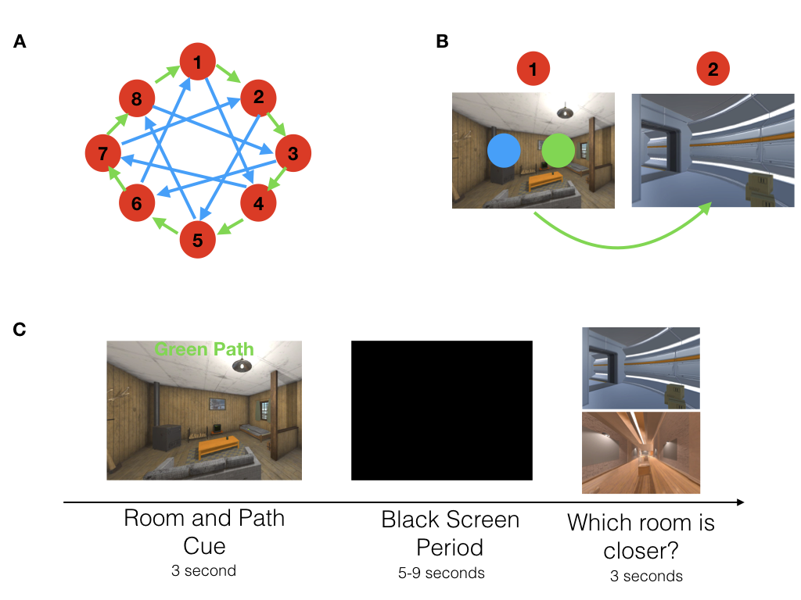

```{r setup, include=FALSE}
packrat::restore()

knitr::opts_chunk$set(echo = TRUE)

#UNCOMMENT BEFORE TESTING/SUBMITTING!!!

baseDir<-getwd()

#what to do with working directories?? can this just stay commented?
#setwd("~/Desktop/Repro_Methods_Final_Pipeline/Repro_Methods_Project/")
source("pred_nav_analysis.R")

#load packages
library(ggplot2)
library(tidyverse)
library(gridExtra)
install.packages('progress')

#setwd back to the main directory
setwd(baseDir)
```

Memory for previous experiences does not merely allow us to reflect on our past, but enables preparation for the future. One way in which this is accomplished is through prediction: knowledge of sequential structure in our environment enables anticipation of upcoming events. For example, when we are navigating from our house to the grocery store, we can predict upcoming locations on our route. Evidence for prediction of upcoming events has been shown across multiple brain regions such as the hippocampus, mPFC, and visual cortex (Johnson & Redish, 2007; Brown et al., 2016; Long, Lee & Kuhl, 2016; Hindy, Ng & Turk-Browne, 2016). 

For efficient planning, however, we should predict multiple steps into the future simultaneously. For example, when navigating from our house to the grocery store, we may predict which event is occurring next, such as an upcoming intersection, and which events are occurring farther in the future, such as arriving at the grocery store. What are the neural underpinnings of multi-step prediction? It is postulated that the brain represents retrospective information on a hierarchy, with shorter timescale information represented in posterior regions and longer timescale information in anterior regions (Hasson, Chen & Honey, 2015). An intriguing but unresolved question is whether the neural underpinnings of multi-step prediction rely on this cortical hierarchy as well. Further, an important but unresolved question is how predictions are updated when we encounter new information about our environments. Memory integration, the process by which separate but related experiences become linked in the brain (Schlichting & Preston, 2015), is proposed to be enhanced by the strength of predictions (Schlichting, Mumford, & Preston, 2015; Long et al., 2016). Changes to pre-existing predictive representations after integration, however, have yet to be explored. The current study uses a novel paradigm to investigate the neural mechanisms of multi-step prediction, and how multi-step predictions are updated after memory integration. 

Evidence for forward prediction in the brain was first shown in rodent work investigating place cell firing. As rodents navigated a maze, place cells for upcoming locations, as opposed to place cells which reflect the rodent’s current location, fired in the hippocampus at a decision point (Johnson & Redish, 2007). This is thought to reflect prediction of upcoming events. Indeed, evidence for prediction in the hippocampus has been shown across many studies in both humans and non-human animals (Schapiro, Kustner & Turk-Browne, 2012; Pfeiffer & Foster, 2013; Brown et al., 2016; Kok & Turk-Browne, 2016;). Prediction has also been shown to occur across multiple other brain regions. For example, one study found evidence for strong neural predictions in the mPFC and PPC (Long et al., 2016). Other studies have shown that prediction can happen in lower order regions such as the visual cortex (Hindy et al., 2016; Kok, Jehee & de Lange, 2012). 

In a seminal paper on forward prediction, participants navigated a well learned environment to reach navigational goals. At the start of navigation, participants were first asked to plan their route. During the planning period, it was found that the hippocampus and OFC represented the upcoming goal location, reflecting prospection. Importantly, this was not only found for the goal location, but for other locations that participants would traverse on that route, known as sub-goals (Brown et al., 2016). This provides preliminary evidence for the neural representation of multi-step prediction, but Brown et al. (2016) only showed prediction two steps into the future—the goal and the sub-goal. Further, they did not study the timescale of these two-step predictions across brain regions (Brown et al., 2016).
 
A separate body of work on information representation may provide a window into understanding the timescale of multi-step prediction. Recently, theories on information processing in the brain have been gaining traction. These theories postulate that we acquire information from our environment at multiple timescales, and different brain regions process this information within distinct temporal receptive windows. Lower order regions such as early sensory areas process information on short timescales, while higher order regions process information on long timescales (Hasson et al., 2015). This cortical hierarchy of information processing has been shown for narrative processing (Chen et al., 2016), as well as the granularity at which we segment events (Baldassano et al., 2017). A similar hierarchy has been proposed within the hippocampal long axis: fine grained information may be represented in the posterior hippocampus while coarse grained information is represented in the anterior hippocampus (Poppenk et al., 2013; Strange et al., 2014). Indeed, a recent study investigated hippocampal activity as participants navigated familiar routes. Consistent with a processing hierarchy in the hippocampal long axis, they found evidence for short timescale information in posterior hippocampus and long timescale information in anterior hippocampus (Brunec et al., 2018). This cortical hierarchy, however, has only been investigated for the accumulation of retrospective information. Bridging work on prediction and information processing, this study aims to extend evidence for a representational hierarchy to prospective information. We propose that multi-step prediction may be represented across this cortical hierarchy, with lower order regions and posterior hippocampus representing prediction fewer steps into the future than higher order regions and anterior hippocampus. 

The second question this study seeks to address is how neural predictions are updated when our environments are updated with new information. One way in which this can occur is the process of memory integration, whereby two separate but related experiences can become linked in the brain (Schlichting & Preston, 2015). Memory integration has been shown to involve, among other regions, the hippocampus and mPFC (Zeithamova, Dominick & Preston, 2012), two regions which are also implicated in prediction (Long et al., 2016). Indeed, previous work has strongly suggested that prediction plays an important role in memory integration (Schlichting et al., 2015), and it has been shown that the strength of neural predictions is positively correlated with successful memory integration (Long et al., 2016). However, it has yet to be shown whether integration influences prediction. Can integration update our predictions, and if so, how rapidly? 

If predictions are updated after integration, a critical question is how this is achieved. On one hand, theories of sequence learning propose that predictions are built up slowly, after multiple, repeated experiences (Davachi & Dubrow, 2015). This is consistent with findings from statistical learning tasks. For example, there is evidence of forward prediction for items in a structured sequence after multiple exposures to that sequence (Schapiro et al., 2012). This perspective suggests that predictions are built up slowly over time and multiple learning experiences. On the other hand, episodic memory integration provides evidence for mnemonic updating after a single shot learning experience, such as in the associative inference paradigm. In this paradigm, participants learn that A and B go together. They then learn that A and C also go together, providing an indirect link between B and C (Schlichting & Preston, 2015; Duncan & Schlichting, 2018). Indeed, it has been shown that hippocampal-mPFC representations are altered after new information is integrated into existing memories (Milivojevic, Vicente-Grabovetsky & Doeller, 2015). Following this logic, predictions about upcoming events may be updated rapidly upon encountering new information. Although memory integration has been well studied, the lasting effects of integration on mnemonic predictions have yet to be investigated. 

In the current study, we leverage neural evidence of processing hierarchies, prediction, and memory integration to make predictions about the representation of multi-step predictions behaviourally and in the brain and how they are updated to reflect new information using a novel, naturalistic paradigm. On day one, participants learn to navigate through a series of rooms in virtual reality in two maps. Critically, these rooms have a constant order, allowing participants to predict upcoming rooms on their route. On day 2, participants predict rooms in the sequence in a behavioural task. We then give them linking information to integrate the two maps into a cohesive whole, and have them predict using the integrated map. We hypothesize that multi-step predictions will be represented on a cortical hierarchy, with lower order regions predicting fewer steps into the future than higher order regions. We further predict that integration will update predictions. However, this updating could happen slowly, requiring time and experience, or quickly, as a result of single shot learning.

  
## Method

## Results

  
  `r round(mean(acc$mean_acc), digits =2)`
  

```{r}

```

```{r, out.width = "1100px", echo=FALSE}
#how to make it an appropriate size?
#plots for the prediction portion of the experiment
acc_plot #accuracy for each participant for prediction
plot_path #accuracy for green/blue paths
plot_distance #accuracy for correct distance into future
plot_distance_time #accuracy for correct dist x prediction time - THIS IS THE RIGHT SIZE, DO THIS FOR THE INT PLOTS

```


```{r, out.width = "1000px", echo=FALSE}
#plots for the integration portion
acc_int_plot #accuracy for integration for each participant
plot_run_int #accuracy for runs (spag plot)
plot_int_noInt #int vs no int cond
plot_int_noInt_run #int vs no int by run

plot_distance_run_int
plot_distance_int
```

```{r, echo = FALSE}
#shiny plot to look at plots by run
#remake integration data to prepare for shiny

shiny_prep<-cast(int_data, participant + Int_All_Runs.thisN + cond~., mean, value = "acc", na.rm=T, subset = (cond != ""))
colnames(shiny_prep)[colnames(shiny_prep)=="(all)"] <- "mean_acc"
shiny_prep$Run_1<-ifelse(shiny_prep$Int_All_Runs.thisN == 0, TRUE, FALSE)
shiny_prep$Run_2<-ifelse(shiny_prep$Int_All_Runs.thisN == 1, TRUE, FALSE)
shiny_prep$Run_3<-ifelse(shiny_prep$Int_All_Runs.thisN == 2, TRUE, FALSE)
shiny_prep$Run_4<-ifelse(shiny_prep$Int_All_Runs.thisN == 3, TRUE, FALSE)

shiny_bar_prep<-cast(int_data, cond~., mean, value = "acc", na.rm=T, subset = (cond != ""))
colnames(shiny_bar_prep)[colnames(shiny_bar_prep)=="(all)"] <- "mean_acc"
print(cond_mean)

inputPanel(
  selectInput("Run", label = "Integration Activity by Run:",
              choices = c("Run_1", "Run_2", "Run_3", "Run_4"),
              selected = "Run_1")
)

renderPlot({
  ggplot(data = shiny_prep, aes(cond, mean_acc)) +
    #geom_bar(data=shiny_bar_prep, aes(y=mean_acc,x=cond),fill  = "white", color = "black", stat = "identity", width = 0.5) +
    geom_violin(fill = "grey", alpha = 0.3) +
    geom_point(aes_string(color = input$Run), alpha=0.8, size=5, position = position_jitter(w = 0.15, h = 0)) +
    theme_classic(base_size = 22) +
    xlab("Condition") +
    ylab("Accuracy (%)") 
})
```

## Discussion
